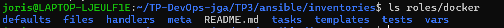
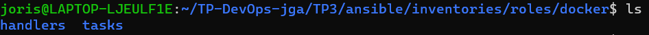

# TP 3

## Introduction

### Inventories

Je crée le fichier `setup.yml` dans `TP3/ansible/inventories/setup.yml`

```yml
all:
 vars:
   ansible_user: centos
   ansible_ssh_private_key_file: /home/joris/.ssh/id_rsa_ansible
 children:
   prod:
     hosts: joris.garcia.takima.cloud
```

Je vais dans le repertoire : `ansible` et j'execute cette commande :

```yml
ansible all -i inventories/setup.yml -m ping
```

Le resultat du ping :

```yml
joris.garcia.takima.cloud | SUCCESS => {
    "ansible_facts": {
        "discovered_interpreter_python": "/usr/bin/python"
    },
    "changed": false,
    "ping": "pong"
}
```

### Facts

Pour demander au serveur la distribution :

```shell
ansible all -i inventories/setup.yml -m setup -a "filter=ansible_distribution*"
```

Le resulat :

```shell
joris.garcia.takima.cloud | SUCCESS => {
    "ansible_facts": {
        "ansible_distribution": "CentOS",
        "ansible_distribution_file_parsed": true,
        "ansible_distribution_file_path": "/etc/redhat-release",
        "ansible_distribution_file_variety": "RedHat",
        "ansible_distribution_major_version": "7",
        "ansible_distribution_release": "Core",
        "ansible_distribution_version": "7.9",
        "discovered_interpreter_python": "/usr/bin/python"
    },
    "changed": false
}
```

Pour supprimer le serveur httpd :

```shell
ansible all -i inventories/setup.yml -m yum -a "name=httpd state=absent" --become
```

Le résultat :

```shell
joris.garcia.takima.cloud | CHANGED => {
    "ansible_facts": {
        "discovered_interpreter_python": "/usr/bin/python"
    },
    "changed": true,
    "changes": {
        "removed": [
            "httpd"
        ]
    },
    "msg": "",
    "rc": 0,
    "results": [
        "Loaded plugins: fastestmirror\nResolving Dependencies\n--> Running transaction check\n---> Package httpd.x86_64 0:2.4.6-99.el7.centos.1 will be erased\n--> Finished Dependency Resolution\n\nDependencies Resolved\n\n================================================================================\n Package      Arch          Version                       Repository       Size\n================================================================================\nRemoving:\n httpd        x86_64        2.4.6-99.el7.centos.1         @updates        9.4 M\n\nTransaction Summary\n================================================================================\nRemove  1 Package\n\nInstalled size: 9.4 M\nDownloading packages:\nRunning transaction check\nRunning transaction test\nTransaction test succeeded\nRunning transaction\n  Erasing    : httpd-2.4.6-99.el7.centos.1.x86_64                           1/1 \n  Verifying  : httpd-2.4.6-99.el7.centos.1.x86_64                           1/1 \n\nRemoved:\n  httpd.x86_64 0:2.4.6-99.el7.centos.1                                          \n\nComplete!\n"
    ]
}
```

3-1 Document your inventory and base commands :

```shell
all: #  désigne tous les hôtes et groupes définis dans cet inventaire.
 vars: # Définir des variables applicables à tous les hôtes 
   ansible_user: centos # 'spécifie le nom d'utilisateur à utiliser lors de la connexion aux hôtes. 'centos' est l'utilisateur pour toutes les connexions SSH.
   ansible_ssh_private_key_file: /home/joris/.ssh/id_rsa_ansible # indique le chemin d'accès au fichier de clé privée SSH utilisé pour se connecter aux hôtes.
 children: # permet de définir des groupes d'hôtes.
   prod: # est un groupe d'hôtes
     hosts: joris.garcia.takima.cloud # liste les adresses des hôtes appartenant à ce groupe.
```

## Playbooks

### First playbook

Je crée un playbook dans `TP3/ansible/playbook.yml`.

```yml
- hosts: all
  gather_facts: false
  become: true

  tasks:
   - name: Test connection
     ping:
```

Je verifie la syntaxe avec :

```shell
ansible-playbook -i inventories/setup.yml playbook.yml --syntax-check
```

Pour tester le playbook.yml :

```shell
ansible-playbook -i inventories/setup.yml playbook.yml
```

Le resultat :

```shell
PLAY [all] *************************************************************************************************************************************************

TASK [Test connection] *************************************************************************************************************************************
ok: [joris.garcia.takima.cloud]

PLAY RECAP *************************************************************************************************************************************************
joris.garcia.takima.cloud  : ok=1    changed=0    unreachable=0    failed=0    skipped=0    rescued=0    ignored=0

```

### Advanced Playbook

Je crée donc un nouveau playbook : `docker.yml` qui va installer docker.

```yml
- hosts: all
  gather_facts: false
  become: true

# Install Docker
  tasks:
  - name: Install device-mapper-persistent-data
    yum:
      name: device-mapper-persistent-data
      state: latest

  - name: Install lvm2
    yum:
      name: lvm2
      state: latest

  - name: add repo docker
    command:
      cmd: sudo yum-config-manager --add-repo=https://download.docker.com/linux/centos/docker-ce.repo

  - name: Install Docker
    yum:
      name: docker-ce
      state: present

  - name: Install python3
    yum:
      name: python3
      state: present

  - name: Install docker with Python 3
    pip:
      name: docker
      executable: pip3
    vars:
      ansible_python_interpreter: /usr/bin/python3

  - name: Make sure Docker is running
    service: name=docker state=started
    tags: docker
```

je verifie la syntaxe :

```shell
ansible-playbook --syntax-check -i inventories/setup.yml docker.yml
```

Pour executer le playbook :

```shell
ansible-playbook  -i inventories/setup.yml docker.yml
```

Le resultat :

```shell
PLAY RECAP *************************************************************************************************************************************************
joris.garcia.takima.cloud  : ok=7    changed=7    unreachable=0    failed=0    skipped=0    rescued=0    ignored=0
```

### Using roles

Pour initialiser un nouveau rôle dans le système de gestion de configuration Ansible.

```shell
ansible-galaxy init roles/docker
```

Les répertoires sont créés :



Je garde seulement les répertoires `tasks` et `handlers`



Je crée un autre playbook `roles.yml` pour tester le role :

```yml
- name: roles
  hosts: all
  become: true
  roles:
    - roles/docker
```

```shell
ansible-playbook --syntax-check -i inventories/setup.yml roles.yml 
```

Pour tester :

```shell
 ansible-playbook --syntax-check -i inventories/setup.yml roles.yml
 ```

3-2 Document your playbook

## Deploy your App

Je crée les autres roles :

```shell
ansible-galaxy init roles/create_network
ansible-galaxy init roles/launch_database
ansible-galaxy init roles/launch_app
ansible-galaxy init roles/launch_proxy
```

J'ajoute mes roles dans le playbook des roles :

```yml
- name: roles
  hosts: all
  become: true
  roles:
    - install_docker
    - create_network
    - launch_database
    - launch_app
    - launch_proxy
```

```yml
# Fichier tasks pour create network
- name: Create Docker app-network 
  docker_network:
    name: "{{ DOCKER_NETWORK }}"
    state: present
- name: Create network app-proxy
  docker_network:
    name: app-proxy
    state: present
```

```yml
# Fichier tasks pour launch_app
- name: Run Api
  docker_container:
    name: api
    image: "{{ DOCKER_NAME }}/tp-devops-serveur:latest"
    networks:
      - name: "{{ DOCKER_NETWORK }}"
      - name: app-proxy
    env:
      POSTGRES_DB: "{{ DATABASE_DB }}"
      POSTGRES_USER: "{{ DATABASE_USER }}"
      POSTGRES_PASSWORD: "{{ DATABASE_PASSWORD }}"
```

```yml
# Fichier tasks pour launch_database
- name: Run postgresql
  docker_container:
    name: postgresql
    image: "{{ DOCKER_NAME }}/tp-devops-postgresql:latest"
    networks:
      - name: "{{ DOCKER_NETWORK }}"
    env:
      POSTGRES_DB: "{{ DATABASE_DB }}"
      POSTGRES_USER: "{{ DATABASE_USER }}"
      POSTGRES_PASSWORD: "{{ DATABASE_PASSWORD }}"
```

```yml
# Fichier tasks du proxy 
- name: Run HTTPD
  docker_container:
    name: httpd
    image: "{{ DOCKER_NAME }}/tp-devops-serveur:latest"
    ports:
      - "80:80"
    networks:
      - name: app-proxy
```

J'ai crée un fichier qui va contenir les variables d'environnement (`all.yml`).

```yml
DATABASE_DB: "db"
DATABASE_USER: "usr"
DATABASE_PASSWORD: "mdp"

DOCKER_NAME: "jorisgarcia"
DOCKER_NETWORK: "app-network"
```


## Continuous Deployment

Pour déployer en continu l'application, il faut mettre en place un dockerfile et un workflow.

Pour sécuriser les variables, il faut utiliser un `ansible-vault`. Il va permettre de chiffrer les variables de `all.yml`.
Il faut utiliser cette commande et saisir un mot de passe :

```yml
ansible-vault encrypt group_vars/all.yml
```

J'ajoutee donc un répertoire secret sur github `ANSIBLE_VAULT_PASSWORD` qui contient le mot de passe du `ansible-vault`.

Je crée un dockerfile qui va permettre de construire l'image d'ansible :

```yml
# Utilise python comme image de base pour l'image Docker
FROM python:3.8-slim
# Installation de ansible 
RUN pip install ansible
# définit le répertoire de travail dans l'image Docker
WORKDIR /ansible
# CopieR les fichiers et dossiers dans l'image Docker
COPY . /ansible
# Pour exécuter le playbook roles.yml 
CMD ["ansible-playbook", "-i", "inventories/setup.yml", "roles.yml"]
```

Je crée un workflow `deploy.yml` qui va permettre de déployer en continu l'application :

```yml
name: deploy

on:
  workflow_run:
    workflows: [buildpush]
    types: 
      - completed
    branches: 
      - main

jobs:
  deploy:
    # Plateforme d'exécution
    runs-on: ubuntu-22.04

    # Lancer les etapes si le worflow précédent n'a pas échoué 
    if: ${{ github.event.workflow_run.conclusion == 'success' }}
    steps:
    - name: Checkout code
      uses: actions/checkout@v2.5.0

    # Etape pour la connexion à DockerHub
    - name: Login to DockerHub
      run: docker login -u ${{ secrets.DOCKERHUB_USERNAME }} -p ${{ secrets.DOCKERHUB_TOKEN }}

    - name: Build Ansible Docker image
      uses: docker/build-push-action@v3
       with:
         # Chemin relatif où se trouve le code source avec le Dockerfile
         context: ./TP3/ansible
         # Crée un tag pour l'image Docker
         tags:  ${{secrets.DOCKERHUB_USERNAME}}/tp-devops-ansible:latest
         # Publie si le workflow a été déclenché par un push sur la branche main 
         push: ${{ github.ref == 'refs/heads/main' }}

    - name: Run Ansible playbook
      run: |
        docker run --rm \
        -v ${{ github.workspace }}:/workspace \
        -w /workspace \
        -e ANSIBLE_VAULT_PASSWORD=${{ secrets.ANSIBLE_VAULT_PASSWORD }} \
        ${{ secrets.DOCKERHUB_USERNAME }}/tp-devops-ansible:latest \
        ansible-playbook -i inventories/setup.yml roles.yml

    - name: Notify deployment success
      run: echo "Deployment successful!"
```
